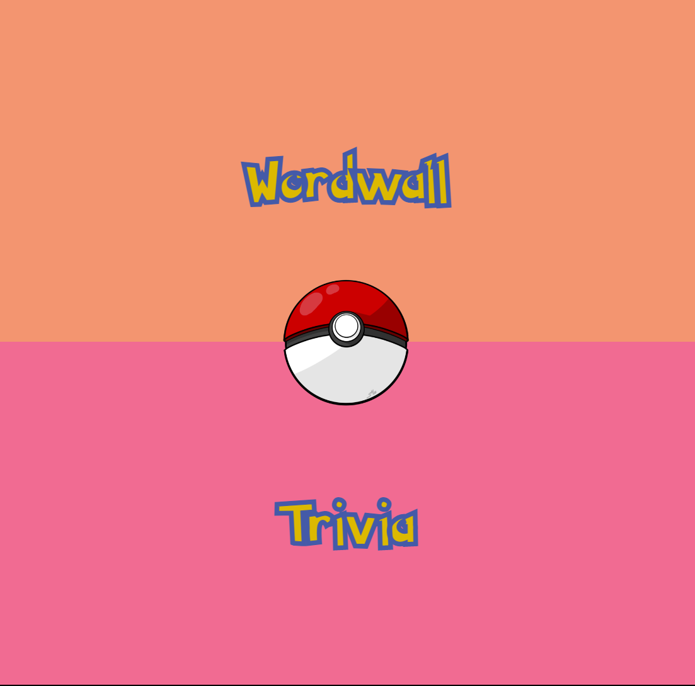
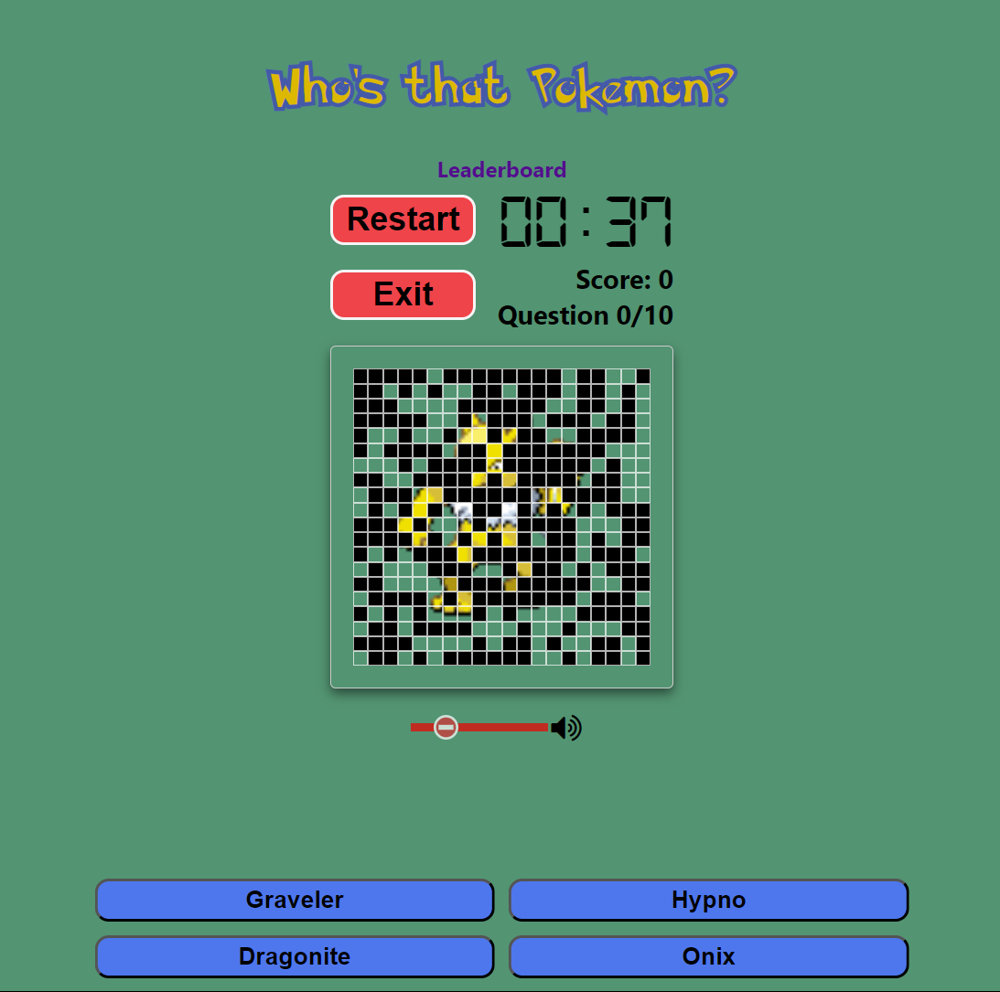
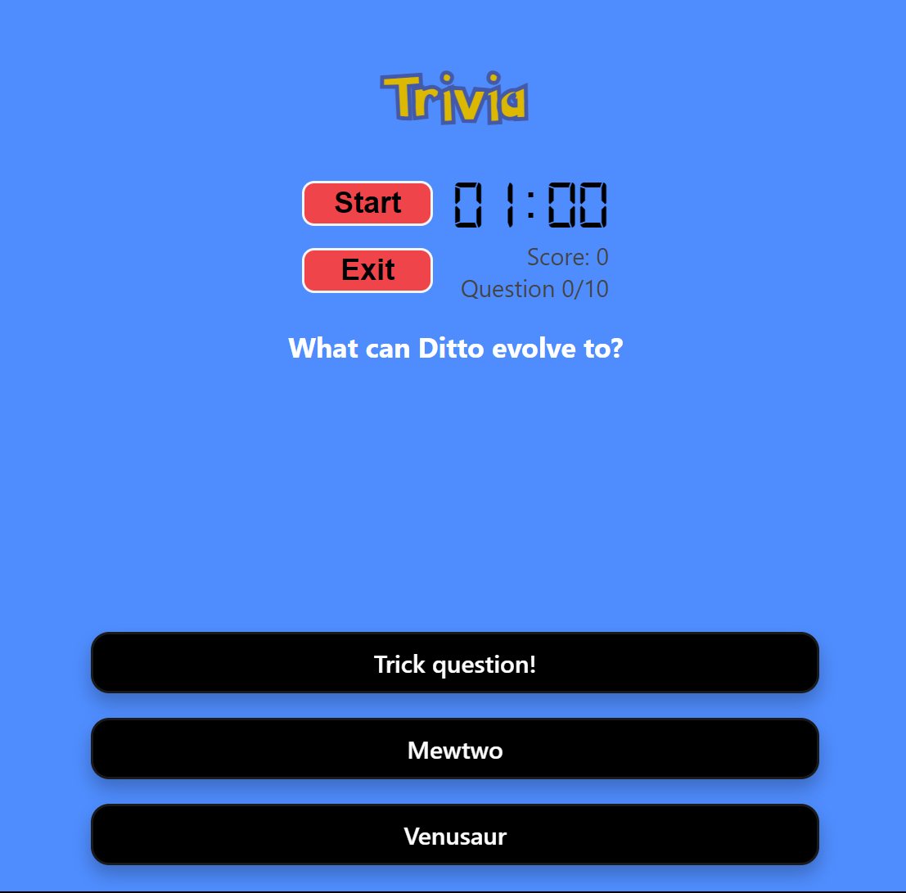

# PokeQuiz

Test your knowledge of the Pokemon universe through this app. PokeQuiz is an app that aims to bundle multiple games into one. The app is utilising Pokemon API as its' data source. The app was made with mobile-first design in mind. You can access the demo [here](https://fancy-mooncake-9337fd.netlify.app/).

## Let's Get Technical
This app consists of a front-end, back-end and a database.

### Front-end: Made with React
The front end of this app is built on React. Upon opening the app, the user lands on the home page, from where they can browse through the games. The app currently have two games: wordwall and trivia.

> Tips: if you hover on the PokeBall logo, a spinning animation is trigerred.

- Wordwall: In this game, the user is to guess which Pokemon appears on the screen within a timeframe. The user is given multiple options to choose for their answer. To add a layer of difficulty, the Pokemon images are partially revealed as time progress. The quicker the user guesses, the more point they will get. At the end of a round, the user is given the opportunity to submit their username and score to be compared against others in a leaderboard. The leaderboard talks to an API made with express using PSQL as the database.
- Trivia: In this game, users will be tested on their knowledge of PokeDex information. A timer and multiple options are given similar to Wordwall.

- Leaderboard: On each game, there is a leaderboard button that leads to a page showing users' attempts and their scores. This leaderboard is connected to a database, with which it communicates using CRUD routes.

### Back-end: Made with Express
The back end of this app consists of API routes that makes leaderboards possible. At the end of a round, the user is prompted to enter their username. This username will then be passed on to the API, adding an entry to the database along with thier achieved score. The leaderboard will only show the best five scores on the page.

### Database: Made with PostgreSQL
The database is made with PostgreSQL with each leaderboard having their own table. Each of these tables records the entry's IDs, username and score. Upon request, the database will fetch the list of scores in descending order to be shown on the leaderboard pages, limited to five entries. The database will also create an entry upon request made at the end of a game round, recording both the username and the score the user achieved on that particular attempt.